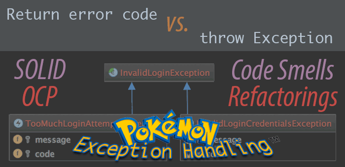

Why throwing exceptions is better than returning error codes
===================

Blog post information
------------------

* Title:         Why throwing exceptions is better than returning error codes
* Main purpose:  Illustrate the benefits to use exceptions rather than returning error codes. Furthermore, go one step ahead and use an approach that helps out to illustrate this process by examples of Code Smells and Refactorings towards a happy SOLID end :)
* URL:           http://javierferrer.me/exceptions-vs-error-codes/
* Date:          2015-02-02
* Categories:    Development
* Tags:          Clean Code, Code smells, Refactoring, Software Design Patterns, SOLID
* Author:       [Ferrer González, Javier](https://twitter.com/JavierCane)

